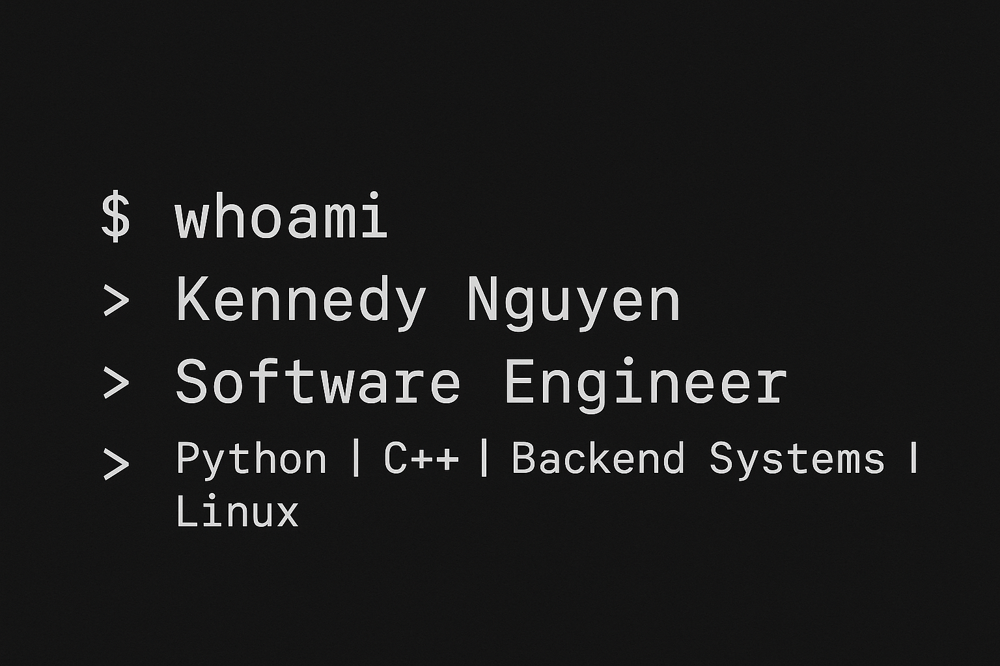

<h1 align="center">Hi, I'm Kennedy Nguyen</h1>

**Software Engineer | Python & C++**  
Phoenix, Arizona | B.S. Software Development (Graduating December 2025)

---

### About Me
- Driven software engineer with a passion for backend systems and automation
- Actively preparing for technical interviews, contributing to real-world projects, and refining system-level thinking
- Focused on building scalable, maintainable solutions that deliver real business value

---

### Tech Stack
**Languages:** Python, C++, JavaScript, Bash  
**Tools & Platforms:** Git & GitHub, Linux, Docker, VS Code, PyCharm  
**Areas of Interest:** System design, infrastructure automation, game development (Pygame), reverse engineering

---

### Current Projects
- **TriPlaySuite** — Python-based game suite including Chess, Tic-Tac-Toe and RNG Guesser
- **Shadow Realms** — Indie roguelike game in active development

---

### GitHub Stats
  

---

### Connect With Me
Email: kennedy@nguyencapital.co  
Alternate Email: kennedy85302@gmail.com  
LinkedIn: https://www.linkedin.com/in/kennedynguyen-se/  
Portfolio Website: coming soon

---

> "Discipline builds results the world can’t ignore."

